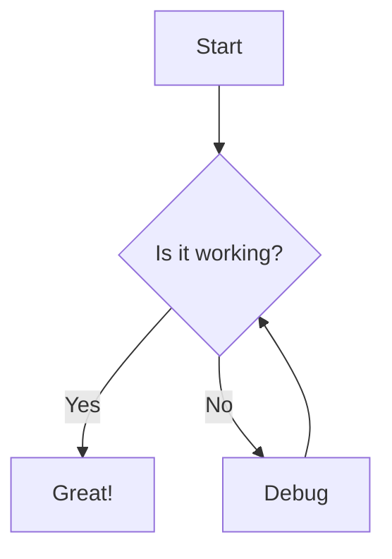

# Markdown & Mermaid Demo

To jest przykładowy plik markdown z obsługą:

- **Podstawowe formatowanie**
- Bloki kodu TypeScript
- Diagramy Mermaid

---

## Kod TypeScript

```typescript
function greet(name: string): string {
  return `Hello, ${name}!`;
}
```

## Diagram Mermaid



## Link

[Przejdź do Google](https://google.com)
